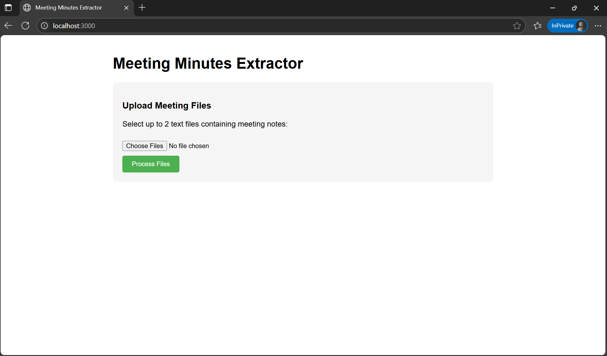
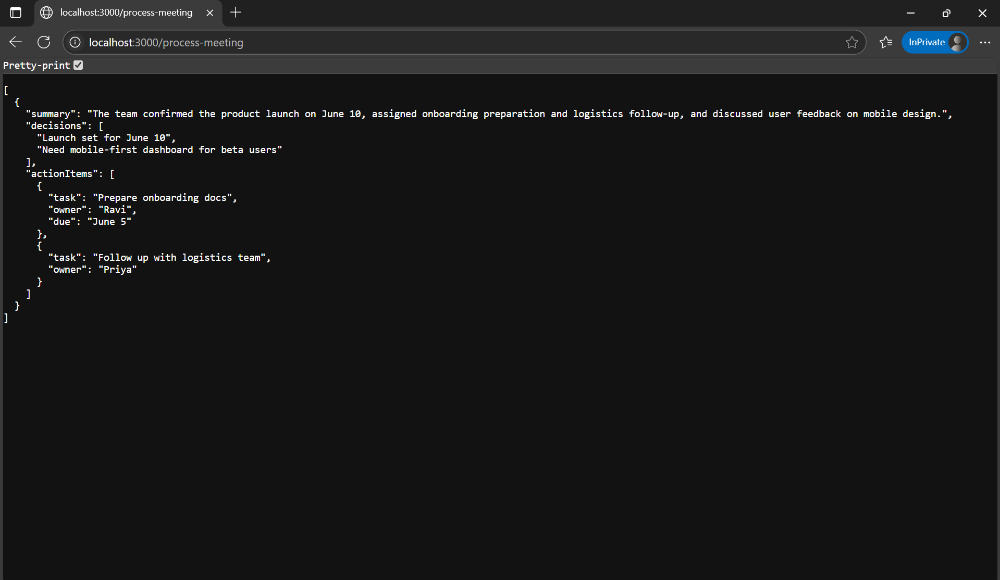

AI-Powered Meeting Minutes Extractor
A Node.js backend service that uses OpenAI to extract key insights from meeting notes, including a summary, decisions, and action items.

Features:
1. Accepts meeting notes via raw text or .txt file upload

2. Calls OpenAI to extract 2–3 sentence summary, list of key decisions, structured list of action items

output:
1. 
2. 
3. 

Returns results in clean, structured JSON

Handles errors gracefully (e.g. API timeouts, missing input)

Includes example inputs and test instructions

Tech Stack: Node Js, Express Js, OpenAI api, Postman

Run Setup Instructions
1. Clone the repository by using the command git clone https://github.com/ankit142002/Minutes-meeting.git
2. Run command cd ai-meeting-minutes.
3. Run npm install to install dependencies
4. Run node server.js This will start the server at http://localhost:3000

Option 1: Send Raw Text (Content-Type: text/plain)

Steps in Postman:

Select POST as method and enter: http://localhost:3000/process-meeting

Go to the Body tab

Choose raw

Select Text from the dropdown (instead of JSON)

Paste the raw content of meeting1.txt (or any sample text)

Click Send

Option 2: Upload a .txt File (multipart/form-data)
Steps in Postman:

Select POST as method and enter: http://localhost:3000/process-meeting

Go to the Body tab

Choose form-data

Add a key named file (make sure it’s set to File, not Text)

Upload your .txt file (e.g., meeting2.txt from /test-files)

Click Send

Included Test Files
Make sure the following sample files are located inside your project folder at text files:

meeting notes.txt

meeting2.txt

